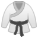
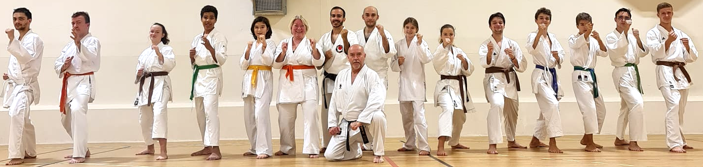
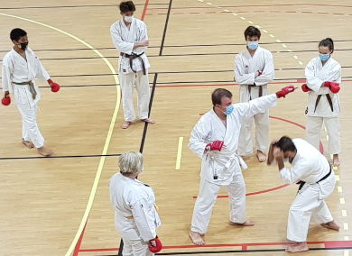
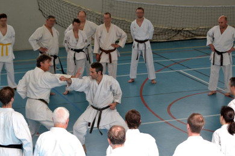
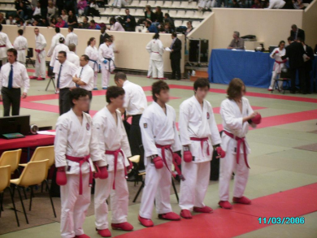
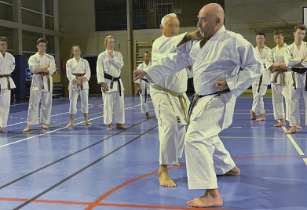

 <link rel="shortcut icon" type="image/png" href="karategi.png">

#  Déménagement dans le nouveau gymnase Arnaud Beltrame dès le 12 mars!

Club de karaté do Shotokan
- Enfants, ados et adultes
- Karaté traditionnel
- Self défense
- Compétition combat et kata

## Cours

Gymnase Arnaud Beltrame  
Allée Arnaud Beltrame, 92150 Suresnes  

**Mercredi**  
- Ados 18h15 - 19h15
- Adultes 19h30 - 21h

**Samedi**  
- Ados/Adultes 10h30 - 12h
- Enfants 6/8 ans 14h - 15h
- Enfants 9/12 ans 15h - 16h
- Cours spécifiques 16h - 17h

Vacances: en général, les cours n'ont pas lieu pendant les vacances scolaires, sauf le premier samedi des vacances.

Chaîne YouTube pour retrouver nos cours et nos katas enregistrés:

<iframe width="560" height="315" src="https://www.youtube.com/embed/videoseries?list=PLFyA7dBi1OKxRijOP8j6qMeFodn9YHJf-" frameborder="0" allow="accelerometer; autoplay; clipboard-write; encrypted-media; gyroscope; picture-in-picture" allowfullscreen></iframe>

Recommandations de lecture: [Lectures](pages/lectures.md)

## Enseignants

Professeur: Pascal Pinault, 5ᵉ dan
Assistant: Nicolas Parot Alvarez, 4ᵉ dan
Fondateur: Pierre Blot, 8ᵉ Dan

## Inscription

Vous pouvez vous préinscrire grace à ce [formulaire](https://forms.gle/excEunBTDi79i3kL8). 

Le réglement se fait sur le lieu des cours.  
L'inscription est actée à la réception du règlement.

Les prix comprennent 38€ de [licence](https://www.ffkarate.fr/espace-licencies/la-licence-federale/) de la Fédération Française de Karaté qui inclue une assurance en responsabilité civile et accidents corporels.  

Le réglement peut se faire par chèque ou espèces et peut se faire en deux fois.  

_Un cours d'essai gratuit est possible._

Tarifs:
- Enfant (≤ 12 ans): 180 €
- Deuxième enfant (≤ 12 ans) de la même famille: 150 €
- Étudiant (≥ 13 ans): 250 €
- Adulte: 300 €

Certificat médical:  
Se référer à la circulaire 2021 de la fédération: [20210730_CIRCULAIRE-007-Certificat-medical-et-questionnaire-de-sante-.pdf](https://sites.ffkarate.fr/hautsdeseine/wp-content/uploads/sites/57/2021/07/20210730_CIRCULAIRE-007-Certificat-medical-et-questionnaire-de-sante-.pdf)

## Contact

Pascal Pinault: 06 72 89 76 64  
kcsuresnes@gmail.com

Site maintenu par [NicolasPA](https://github.com/NicolasPA/kcsuresnes).
