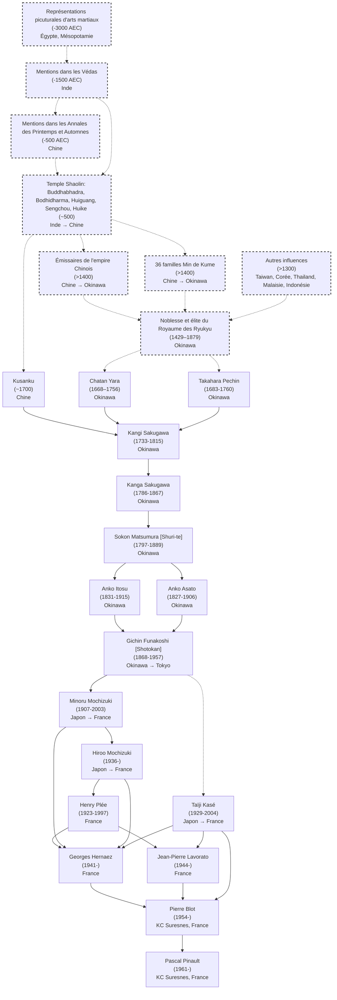

# Lignée historique des professeurs principaux du Karaté Club de Suresnes

<!-- Load Mermaid library from CDN -->

<!-- Optional: Style Mermaid diagrams -->

<!-- Initialize Mermaid and render diagrams -->

