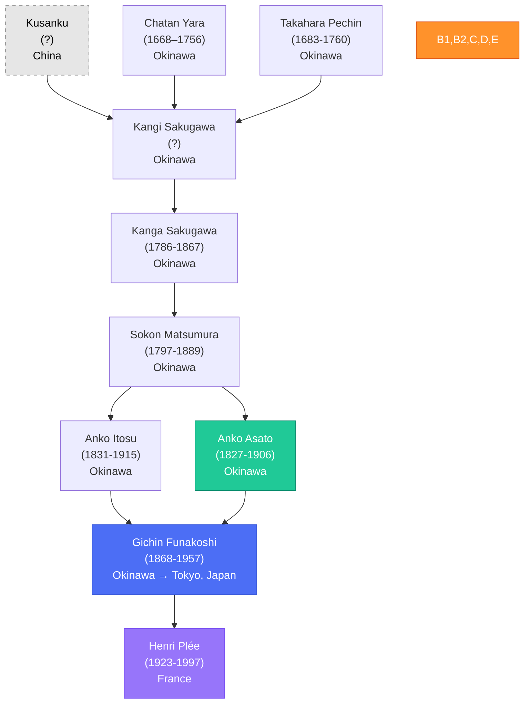

# Lignée des professeurs principaux du Karaté Club de Suresnes

```mermaid
graph TD
    A1["Kusanku<br/>(?)<br/>China"]
    A2["Chatan Yara<br/>(1668–1756)<br/>Okinawa"]
    A3["Takahara Pechin<br/>(1683-1760)<br/>Okinawa"]
    B1["Kangi Sakugawa<br/>(?)<br/>Okinawa"]
    A1 --> B1
    A2 --> B1
    A3 --> B1
    --> B2["Kanga Sakugawa<br/>(1786-1867)<br/>Okinawa"]
    --> C["Sokon Matsumura<br/>(1797-1889)<br/>Okinawa"]
    --> D["Anko Itosu<br/>(1831-1915)<br/>Okinawa"]
    C --> E["Anko Asato<br/>(1827-1906)<br/>Okinawa"]
    D --> F["Gichin Funakoshi<br/>(1868-1957)<br/>Okinawa → Tokyo, Japan"]
    E --> F
    --> G["Henri Plée<br/>(1923-1997)<br/>France"]
        
    style A1 fill:#e6e6e6,stroke:#999999,color:#000,stroke-dasharray: 5 5
    style B1,B2,C,D,E fill:#ff922b,stroke:#d9480f,color:#fff
    style F fill:#ff922b,stroke:#d9480f,color:#fff
    style G fill:#20c997,stroke:#0f8d6f,color:#fff
    style E fill:#20c997,stroke:#0f8d6f,color:#fff
    style F fill:#4c6ef5,stroke:#3b5bdb,color:#fff
    style G fill:#9775fa,stroke:#7950f2,color:#fff
```
